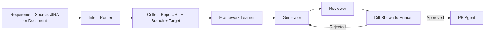

# Agentic Workflow for Test Engineers

This repository helps test engineers do two things from business requirements:

1. Create manual test cases in JIRA Xray-compatible CSV format.
2. Create automation scripts for Playwright, Karate DSL, and Appium grounded in existing framework repository conventions.

The workflow is human-in-the-loop (HITL): generation is gated by review and explicit approval before PR creation.

## What You Can Do

- Convert requirement documents or JIRA stories into structured manual test cases.
- Generate framework-aligned automation artifacts (feature files, step definitions, test classes, or equivalent) by first learning your framework repository.
- Review the proposed diff before code is pushed.
- Create PRs only after explicit human approval.

## Workflow Overview



## Repository Components

- `src/index.ts`: MCP server entrypoint and tools.
- `src/karate-knowledge.ts`: Karate DSL knowledge base.
- `.github/agents/intent-router.agent.md`: request classification and routing.
- `.github/agents/framework-learner.agent.md`: learns framework conventions.
- `.github/agents/generator.agent.md`: generates artifacts after learning.
- `.github/agents/reviewer.agent.md`: validates generated artifacts.
- `.github/agents/pr-agent.agent.md`: creates branch/commit/PR after approval.
- `.vscode/mcp.json`: workspace MCP server wiring.
- `framework-config.json`: framework repository URLs and default branches.

## Prerequisites

- Node.js 18+
- VS Code 1.102+
- GitHub Copilot Chat with MCP enabled
- Access to JIRA (optional but recommended)
- Access to target framework repositories (Playwright, Karate, Appium)

## One-Time Setup

1. Clone repository and install dependencies.

```bash
git clone https://github.com/themaurya/Agentic-workflow.git
cd Agentic-workflow
npm install
```

2. Build the MCP server.

```bash
npm run build
```

3. Confirm build output exists.

```bash
# Windows PowerShell
Test-Path dist/index.js
```

4. Verify workspace MCP configuration in `.vscode/mcp.json`.

The `karate-dsl` server should point to:

- `c:/Users/Sanjay/agentic-workflow/dist/index.js` (or your absolute local path)

5. Update `framework-config.json` with your framework repositories and branches.

Example:

```json
{
  "playwright": {
    "githubUrl": "https://github.com/<org>/<playwright-framework-repo>.git",
    "branch": "main"
  },
  "karateDsl": {
    "githubUrl": "https://github.com/<org>/<karate-framework-repo>.git",
    "branch": "main"
  },
  "appium": {
    "githubUrl": "https://github.com/<org>/<appium-framework-repo>.git",
    "branch": "main"
  }
}
```

## How Test Engineers Use This

### A) Create Manual Test Cases from JIRA/Requirements

Use your chat prompt to provide:

- Requirement source: JIRA story ID or uploaded requirement doc.
- Scope: what feature/module to cover.
- Priority/tag preferences.

Example prompts:

- `Create manual test cases from JIRA story QA-142 for happy path and edge cases in Xray CSV format.`
- `Generate Xray CSV test cases from this requirement document for payment retry and timeout scenarios.`

Expected output:

- Structured manual test case CSV with step, data, expected result columns.
- Ready for JIRA/Xray import.

If needed, use the MCP tool flow equivalent:

- `generate_xray_testcases_csv` with project key, issue type, and test case steps.

### B) Create Framework-Grounded Automation Scripts

Use your chat prompt to provide:

- Framework type: Playwright, Karate, or Appium.
- Requirement source: JIRA ID or requirement doc.
- GitHub framework repository URL.
- Target branch name.
- Target app URL/spec/build context.

Example prompts:

- `Create Playwright automation for JIRA QA-142. Repo: https://github.com/acme/playwright-java-framework.git branch: main.`
- `Generate Karate API tests for this story using https://github.com/acme/karate-api-framework.git branch: develop.`
- `Create Appium test flow from this requirement using https://github.com/acme/appium-framework.git branch: main.`

The system enforces this sequence:

1. Intent router classifies request.
2. Required inputs (repo + branch + source) are collected.
3. Framework learner reads requirements, then learns framework conventions.
4. Generator creates artifacts in framework style.
5. Reviewer validates quality and completeness.
6. Human reviews diff.
7. PR agent creates PR only after explicit approval.

## HITL Rules (Enforced)

- No repo URL or branch: generation is blocked.
- No framework learning: generation is blocked.
- No reviewer READY FOR APPROVAL: PR is blocked.
- No explicit human approval: PR is blocked.
- Direct push to main/master by PR agent is blocked.

## Daily Runbook for Test Engineers

1. Start from requirement (JIRA or doc).
2. Ask for either manual test case CSV or automation script.
3. Provide framework repo URL and branch when asked.
4. Validate generated diff carefully.
5. Approve only after review comments are resolved.
6. Confirm PR creation request explicitly.

## Validation Checklist

Before using in production, verify:

1. `npm run build` succeeds.
2. `dist/index.js` exists.
3. `.vscode/mcp.json` is present and valid.
4. `framework-config.json` has correct repo URLs/branches.
5. MCP tools are visible in chat (for example via karate-dsl requests).
6. Agent files exist under `.github/agents`.

## Troubleshooting

### MCP server not available

- Run `npm install`.
- Run `npm run build`.
- Ensure `.vscode/mcp.json` path is absolute and correct.
- Restart VS Code window.

### Build fails with TypeScript errors

- Ensure dependencies are installed in this workspace.
- Re-run `npm install` then `npm run build`.

### Agent asks repeatedly for inputs

- Provide all required values in one prompt:
  - framework
  - repo URL
  - branch
  - requirement source
  - target context (url/spec/build)

### PR not created

- Confirm reviewer status is READY FOR APPROVAL.
- Provide explicit approval text such as: `approved, create PR`.

## Suggested Prompt Templates

Manual test cases:

`Create JIRA Xray CSV test cases from JIRA <ID> for <feature scope>. Include positive, negative, and boundary scenarios.`

Playwright:

`Use Playwright framework repo <repo-url> branch <branch>. Generate tests from JIRA <ID>, then show diff for approval.`

Karate:

`Use Karate framework repo <repo-url> branch <branch>. Generate API tests from requirement doc, then show diff for approval.`

Appium:

`Use Appium framework repo <repo-url> branch <branch>. Generate mobile automation from JIRA <ID>, then show diff for approval.`

## Notes for Leads

- Keep framework repositories clean and convention-driven so learner outputs remain consistent.
- Update `framework-config.json` when framework repos or default branches change.
- Keep `.github/agents` files versioned and reviewed like code.

---

If you want, this README can also be split into role-specific guides:

- `docs/test-engineer-guide.md`
- `docs/test-lead-governance.md`
- `docs/mcp-admin-setup.md`
